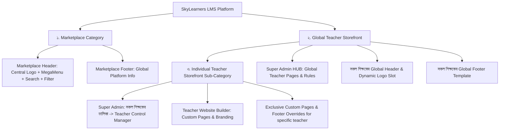

<!-- BEGIN:nextjs-agent-rules -->
# Next.js App Router Architecture & Standards
This version uses Next.js App Router with Internationalization (`[locale]` routing), Firebase Firestore & Auth, Tailwind CSS, and Lucide icons. Read the relevant guide in `node_modules/next/dist/docs/` before writing any code. Heed deprecation notices.
<!-- END:nextjs-agent-rules -->

# 🏛️ SkyLearners Architecture & Development Guidelines

This LMS platform is architected around a **3-Tier Category Framework** with **Dynamic Header/Footer Integration** and **Clean SEO URLs**:

---

## 🌐 1. The 3-Tier Category Framework

### 📂 Tier 1: `Marketplace Category` (গ্লোবাল মার্কেটপ্লেস)
* **Target Audience:** Organic Google/Social visitors, guests, and students who haven't selected a focused teacher academy.
* **Scope:** Displays nationwide courses from all teachers, coaching institutions, platform notices, and global FAQs.
* **Header Components:**
  - Central SkyLearners Logo
  - `marketplaceNavLinks` (`Home` `/`, `Courses` `/courses` [with CourseMegaMenu], `About` `/about`)
  - Global Search Bar & Filters
* **Footer Components:**
  - Central SkyLearners Footer (Platform info, global links, platform support)
* **AI Rule:** When the user says *"Marketplace Header / Footer / NavLinks এ এই পেজ বা ডিজাইন পরিবর্তন করো"*, ONLY edit Marketplace components without touching any teacher storefront.

---

### 👨‍🏫 Tier 2: `Global Teacher Storefront` (সকল শিক্ষকের গ্লোবাল বেস একাডেমি)
* **Target Audience:** Logged-in teachers, visitors arriving via a teacher's referral link, students with a preferred teacher, or visitors on `/teachers/[slug]`.
* **Managed From:** Super Admin Dashboard -> **`Global Teacher Storefront Pages & Rules` HUB**.
* **Header Components:**
  - Dynamic Teacher Logo / Avatar + Academy Name
  - `teacherStorefrontNavLinks` (`Home`, `Courses`, `About`, `যোগাযোগ (Contact)` + Super Admin added Global Pages)
  - Exclusion Rules: Super Admin can exclude specific teachers from specific global pages (`excludedTeacherIds`).
* **Footer Components:**
  - Dynamic Teacher Footer (Teacher's contact info, WhatsApp, address, office hours, quick links, teacher copyright).
* **AI Rule:** When the user says *"Global Teacher Header / Footer / Pages এ এই আপডেট করো"*, update the shared base template so that **ALL teachers** automatically get this update.

---

### 👑 Tier 3: `Individual Teacher Custom Storefront` (নির্দিষ্ট শিক্ষকের কাস্টম একাডেমি)
* **Target Audience:** Specific visitors/students of a single teacher (e.g. Teacher Akash / `teacher-01`).
* **Managed From:** Super Admin Dashboard -> **`সকল শিক্ষকের তালিকা` -> `Teacher Control Manager`** OR Teacher's own **Website Builder** (`/teacher-dashboard/home-builder`).
* **Components:**
  - Specific custom pages (e.g. `/notice`, `/special-batch-2026`, custom notes) registered under that teacher's `customNavLinks`.
  - Specific branding, custom cover photos, custom video intro, and custom value cards.
* **AI Rule:** When the user mentions a specific teacher name/ID (e.g. *"Teacher Akash এর জন্য এই স্পেশাল পেজ তৈরি করো"*), create/modify it strictly under that teacher's document or custom slug route so no other teacher gets affected.

---

## 🔗 2. Clean URL & SEO Standards (Strict)

1. **Clean & Human-Readable Slugs:**
   - Always use clean slugs for courses: `/courses/[courseSlug]`.
   - Always use clean slugs for teacher academies: `/teachers/[teacherSlug]`.
2. **Slug to UID Resolution:**
   - When a visitor visits `/teachers/[slug]`, the system uses `resolveTeacherBySlugOrId` to resolve the actual Firebase UID and stores it in `sessionStorage.setItem('referralTeacherId', uid)`.
   - All subsequent page visits (`/courses`, `/about`, `/contact`, `/[slug]`) in that session stay within that teacher's storefront.
3. **SEO & Canonical Tags:**
   - Referral parameters maintain clean canonical URLs.

---

## 🛠️ 3. Rules for AI Implementation & Maintenance

1. **Always Check the Category First:**
   - Request about Marketplace? -> Target Tier 1 (`marketplaceNavLinks`, Central Logo, Marketplace Footer).
   - Request about All Teachers? -> Target Tier 2 (`teacherStorefrontNavLinks`, Global Pages HUB, Global Teacher Footer).
   - Request about a Specific Teacher? -> Target Tier 3 (`Teacher Control Manager`, `customNavLinks`, Teacher Website Builder).

2. **Zero Mega-Menu in Teacher Mode:**
   - The `CourseMegaMenu` dropdown is exclusively for Marketplace mode. It must NEVER render in Teacher Storefront Mode.

3. **Persistent Dual-Mode Footer:**
   - `Footer.tsx` automatically switches between Marketplace Footer and Teacher Branded Footer based on `isTeacherStorefrontMode`.
